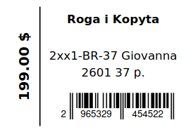

# Barcode Labels Generator

Generate EAN13 barcodes, printable PDF labels, and XLSX files with a barcode column.

## Features

- Stable EAN13 barcode generation
- Same product always gets the same barcode
- Profile-based configuration for different product types
- Configurable Excel column mapping
- Configurable store name
- Product brand support
- Configurable label layouts
- Excel column validation
- PDF label rendering
- XLSX export with barcode column

## Setup

Create virtual environment:

```bash
python3 -m venv venv
```

Activate it:

Linux/macOS:

```bash
source venv/bin/activate
```

Windows:

```bat
venv\Scripts\activate
```

Install dependencies:

```bash
pip install -r requirements.txt
```

## Input XLSX Format

Example for shoes:

| brand    | article    | name          | size | price | currency |
| -------- | ---------- | ------------- | ---- | ----- | -------- |
| Giovanna | 2xx1-BR-37 | Giovanna 2601 | 37   | 199   | USD      |

Example for bags:

| article | name        | price | currency |
| ------- | ----------- | ----- | -------- |
| BG-001  | Leather Bag | 149   | USD      |

## Profiles

The application supports product profiles.

Available demo profiles:

```text
shoes
bags
```

Run with a specific profile:

```bash
python3 main.py --profile shoes
```

```bash
python3 main.py --profile bags
```

Profile files are stored in:

```text
config/profiles/
```

Example profile for shoes:

```json
{
  "store_name": "Roga i Kopyta",
  "columns": {
    "brand": "Brand",
    "article": "Article",
    "name": "Name",
    "size": "Size",
    "price": "Price",
    "currency": "Currency",
    "barcode": "Barcode"
  },
  "product_key_fields": ["article", "size"],
  "label_item_fields": ["article", "name", "size"],
  "layout": "label_58x40_vertical_price"
}
```

Example profile for bags:

```json
{
  "store_name": "Roga i Kopyta",
  "columns": {
    "article": "Article",
    "name": "Name",
    "price": "Price",
    "currency": "Currency",
    "barcode": "Barcode"
  },
  "product_key_fields": ["article"],
  "label_item_fields": ["article", "name"],
  "layout": "label_58x40_vertical_price"
}
```

## Validation

The application validates required Excel columns before processing.

Required columns are determined by:

- `product_key_fields`
- `label_item_fields`
- `price`
- `currency`

If a required column is missing, the application stops with a clear error message:

```text
Required column 'price' not found in Excel file
```

The following columns are optional:

- `brand`
- `barcode`

## Run

Default demo:

```bash
python3 main.py
```

Custom files:

```bash
python3 main.py \
    --profile shoes \
    --input input/products.xlsx \
    --output output/products_with_barcodes.xlsx
```

## Output

Generated files:

```text
output/
├── products_with_barcodes.xlsx
└── products_with_barcodes_labels.pdf
```

## Label Example



## Price Formatting

Prices are formatted automatically:

```text
10990 + UAH -> 10 990.00 грн
199 + USD -> 199.00 $
199 + PLN -> 199.00 PLN
```

### Supported Currency Labels

```python
currency_map = {
    "EUR": "€",
    "RUB": "₽",
    "UAH": "грн",
    "USD": "$",
}
```

Unknown currency codes are displayed unchanged.

Example:

```text
PLN -> PLN
CHF -> CHF
```

## Tests

Run tests:

```bash
pytest
```

Run tests with coverage:

```bash
python -m pytest -p pytest_cov --cov=src --cov-report=term-missing
```

## Notes

Barcodes are stored in:

```text
data/barcodes.json
```

Runtime files are ignored via `.gitignore`.

PDF label size:

```text
58x40 mm
```

## License

This project is licensed under the GNU Affero General Public License v3.0.
