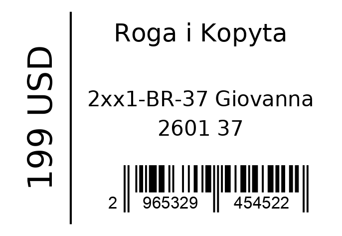

# Barcode Labels Generator

Generate:

- EAN13 barcodes
- PDF labels
- XLSX files with barcode column

## Features

- Stable barcode generation
- Same product always gets the same barcode
- Configurable Excel column mapping
- Configurable store name
- PDF label rendering
- XLSX export with barcode column

## Setup

Create virtual environment:

```bash
python3 -m venv venv
```

Activate:

Linux/macOS:

```bash
source venv/bin/activate
```

Windows:

```bat
venv\Scripts\activate
```

Install dependencies:

```bash
pip install -r requirements.txt
```

## Input XLSX format

| article | name          | size  | price | currency |
| ------- | ------------- | ----- | ----- | -------- |
| 227701  | ICEBERG белый | 40(p) | 290   | грн      |

Actual column names are configurable via:

```text
config/columns.json
```

Example:

```json
{
  "article": "Артикул",
  "name": "Название",
  "size": "Размер",
  "price": "Цена",
  "currency": "Валюта",
  "barcode": "Штрихкод"
}
```

## Application Config

Application settings:

```text
config/app.json
```

Example:

```json
{
  "store_name": "Roga i Kopyta"
}
```

## Run

Default demo:

```bash
python3 main.py
```

Custom files:

```bash
python3 main.py \
    --input input/products.xlsx \
    --output output/products_with_barcodes.xlsx
```

## Output

Generated files:

```text
output/
├── products_with_barcodes.xlsx
└── products_with_barcodes_labels.pdf
```

## Label Example



## Tests

Run tests:

```bash
pytest
```

## Notes

- Barcodes are stored in:

  ```text
  data/barcodes.json
  ```

- Runtime files are ignored via `.gitignore`
- PDF label size:

  ```text
  58x40 mm
  ```
